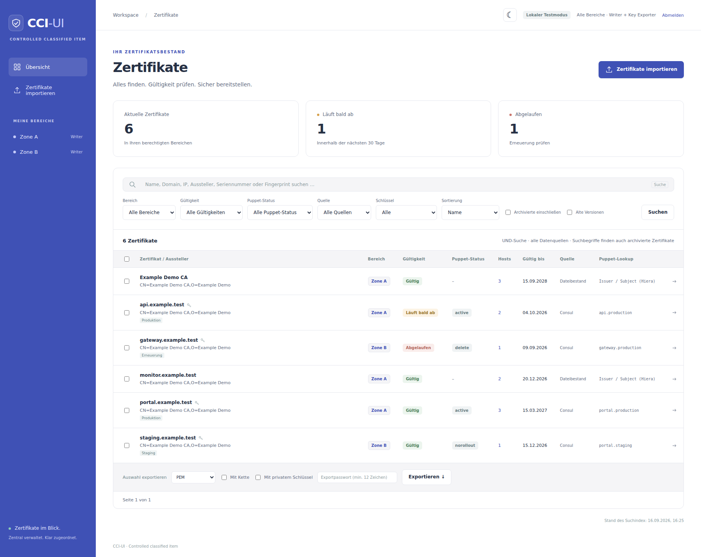
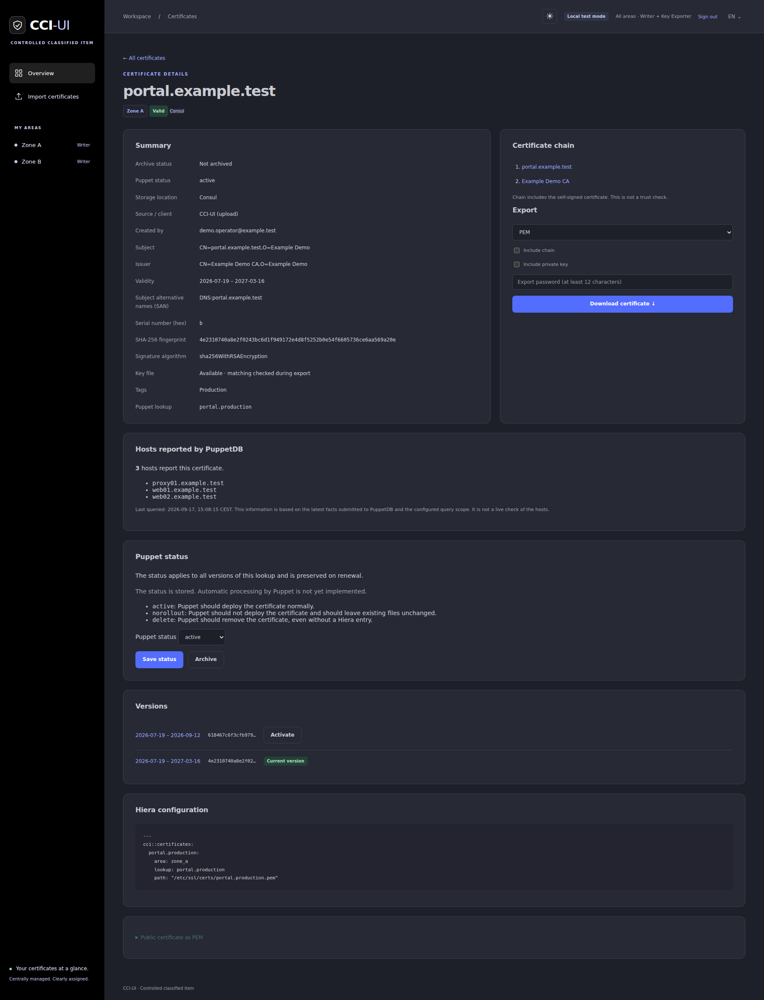
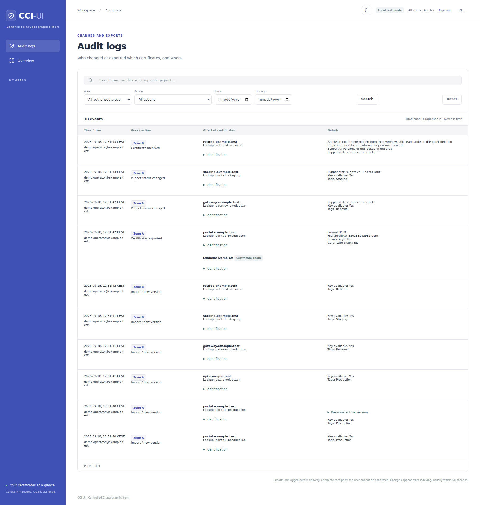

# CCI-UI

**Controlled Cryptographic Item** — certificate management with configurable permission
areas, built with Ruby on Rails, Hotwire, PostgreSQL and HashiCorp Consul.

Search legacy files and new certificates together, manage certificate versions
and Puppet status, and export PEM, DER, PKCS#12/PFX or JKS. The project is multilingual,
with a German and English application interface. The language follows your browser
preferences and can be changed in the language menu. See
[interface languages and adding translations](docs/localization.md).

## Quick start

```console
ruby bin/setup-local
docker compose up --build -d
```

Open [http://localhost:3000](http://localhost:3000) and select a local test identity.
Keycloak is optional in explicit local mode.

The development Compose defaults use **Zone A** and **Zone B**, with local
`data/` mounted read-only as Zone A's `/legacy` inventory. Production settings
come entirely from environment variables:

```bash
export CCI_AREAS='{"zone_a":"Zone A","zone_b":"Zone B"}'
export CCI_LEGACY_PATHS='{"zone_a":"/legacy/zone_a","zone_b":"/legacy/zone_b"}'
export CCI_AREA_KEYS='{"zone_a":"<existing Base64 key>","zone_b":"<existing Base64 key>"}'
```

No area YAML or configuration mount is required. `.env` files are optional;
`ruby bin/setup-local --stdout` emits exports without writing a file for a new
installation. Preserve existing keys when migrating. See the
[environment reference](docs/environment.md) and
[production mount examples](docs/installation.md#configuring-areas).

Area IDs, display names, roles and local test identities are generated from
`CCI_AREAS`. New uploads are stored only in Consul. The indexer refreshes metadata
every 60 seconds.

## Screenshots

These screenshots show the actual application in English using **synthetic demonstration
data only**: example domains, generated certificates and demo identities.
They contain no real certificate, organization or user information. PuppetDB host
associations are synthetic as well. See the [capture script](script/screenshots/capture.cjs)
to reproduce the screenshots in an isolated demo environment.

### Certificate overview

Search, validity and Puppet status filters, source information, host counts and
Puppet lookups in the light theme. Filesystem entries have no Puppet status.



### Certificate details

Certificate metadata, chain, reported PuppetDB hosts, adjacent status and archive
controls, versions and Hiera configuration in the dark theme.



### Audit logs

Area-restricted audit access with timestamps, users, certificate identities and
change details, including an archive confirmation and a Puppet status change.



## Permissions and formats

Readers can search and view details but cannot export. Writers can import,
manage versions and export certificates. Exporting private keys additionally
requires `<area_id>_key_exporter` in the same area.

`<area_id>_auditor` grants access to that area's audit logs without granting
certificate export rights. Logs record changes and exports with time, user and
persistent certificate metadata, including exported chain certificates.

PEM, DER, PKCS#12/PFX and JKS are supported, including bulk and chain exports
where applicable. JKS currently requires matching store and key passwords.
PKCS#12 supports AES/PBES2 and 3DES; legacy RC2 is not supported.

## Overwrite confirmation and Puppet status

Imports into an existing area/lookup require explicit confirmation in the preview.
The server checks that the lookup has not changed since preview; older versions
remain available after renewal. Uploads containing a certificate already on disk
are rejected by DER fingerprint, regardless of lookup or target area. The disk
inventories in all configured areas are checked both before preview and before saving.

Writers can set `active`, `norollout`, or `delete` in certificate details for
Consul certificates only. Filesystem certificates remain read-only catalog
entries without Puppet controls or archiving. The overview displays
“Puppet-Status” and provides a matching filter independently of “Gültigkeit”.
Status changes are audited. Consul stores lookup status, while local files stay
unchanged. Renewals preserve the lookup status.

The UI and indexer never delete certificate entries, stored material, or status
records. This also applies when files disappear, a mount becomes empty, or an
inventory mapping is removed.

Writers can choose “Archivieren” next to “Status speichern” in Consul
certificate details. A separate confirmation page explains the scope and
potential service disruption from the Puppet `delete` request. The server also
requires this confirmation. Archiving sets
`archived: true` and `status: delete` atomically with an audit event in Consul.
It covers all versions of a Consul lookup in that area. Archived entries are
excluded from the default overview and statistics. A text search automatically
includes archived entries and their historical versions. “Archivierte
einschließen” lists them without a search term.

The UI does not reactivate archived entries. Renewals of an archived lookup stay
archived. Details remain readable if the source material disappears, but exports
still require the matching source material. Back up PostgreSQL to retain metadata
for absent sources.

**Puppet execution is deferred:** this release prepares UI and Consul only.
The supplied Puppet manifests do not yet enforce the three statuses. See the
[status contract and rollout requirements](docs/puppet.md#prepared-status-contract).

## Optional PuppetDB host inventory

Set `PUPPETDB_ENABLED=true` and configure the PuppetDB endpoint and custom
certificate fact to show host counts in the overview and hostnames in certificate
details. The query, fact name, fingerprint field and algorithm (`sha256` or `sha1`) are
configurable. The feature is disabled by default, matches certificate fingerprints, and
keeps the last successful associations when PuppetDB is unavailable. See
[configuration and anonymized examples](docs/environment.md#optional-puppetdb-host-inventory)
and [fact formats and synchronization](docs/puppetdb.md).

## Documentation

- [Installation and operations](docs/installation.md)
- [Environment variables and file-free deployment](docs/environment.md)
- [Technical architecture and data storage](docs/technik.md)
- [Consul schema, version selection and Ruby import/read examples](docs/consul-schema.md)
- [Interface languages and adding translations](docs/localization.md)
- [GitHub Actions builds and Docker Hub publishing](docs/container-publishing.md)
- [Puppet integration and idempotence](docs/puppet.md)
- [PuppetDB host inventory](docs/puppetdb.md)
- [Documentation screenshot capture script](script/screenshots/capture.cjs)

## Tests

```console
docker compose run --rm -e RAILS_ENV=test web ruby bin/rails db:prepare test
```

Tests generate their own certificates and use a separate PostgreSQL database
and Consul namespace. Private keys from `data/` are not copied into test fixtures
or Docker images. The legacy application under `quelle/`, local certificate
files, runtime data and secrets are excluded from version control.
