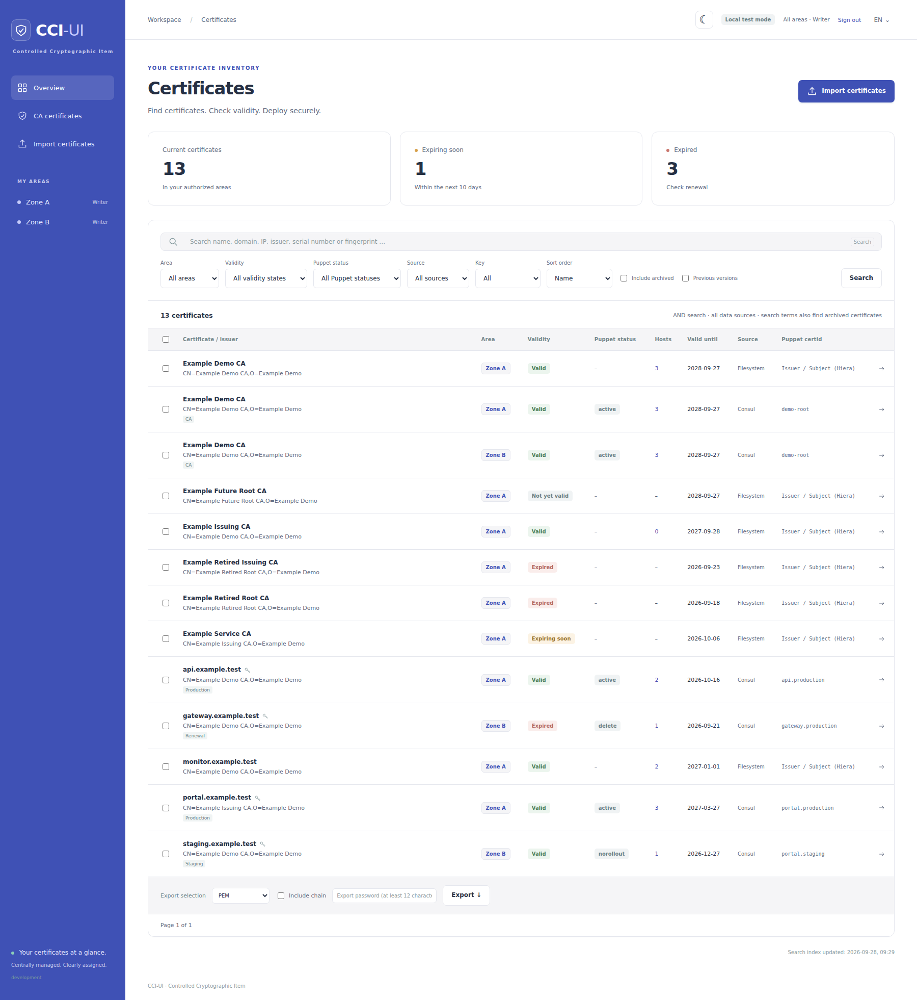

# CCI-UI

**Controlled Cryptographic Item** — a web application for managing X.509
certificates across configurable permission areas. Search existing filesystem
inventories alongside certificates stored in Consul, manage versions, create
certificate requests, and export certificates and authorized private keys.

[](https://github.com/c8m6/cci-ui/actions/workflows/docker-publish.yml)
[](https://github.com/c8m6/cci-ui/actions/workflows/github-code-scanning/codeql)
[](https://github.com/c8m6/cci-ui/releases)
[](LICENSE)
[](https://hub.docker.com/r/c8m6/cci-ui)

Built with Ruby on Rails, Hotwire, PostgreSQL and HashiCorp Consul, with German
and English interfaces. The release badge includes prereleases. Check the
[release notes](https://github.com/c8m6/cci-ui/releases) before deploying.



The overview shows the actual application with synthetic certificates, demo
identities and PuppetDB host associations. Detailed views are documented under
[certificate details](docs/technik.md#certificate-details),
[CA inventory](docs/ca-inventory.md) and [audit logs](docs/technik.md#audit-logs).

## Features

- **Certificate management:** search and filter certificates from Consul and
  legacy files, preview imports, confirm overwrites, retain and activate
  versions, inspect certificate chains, and export PEM, DER, PKCS#12/PFX or JKS.
  Bulk and chain exports are available where applicable.
- **Certificate requests:** create RSA or EC CSRs, retain encrypted request
  keys, and publish matching issued certificates to Consul. Certificate issuance
  by a CA remains an external step.
- **Infrastructure integration:** Puppet readers and Hiera output for
  certificate distribution, optional PuppetDB host associations, and an optional
  CA inventory. Consul certificates have status and archive controls, while
  filesystem deletion uses a separate confirmation and recovery workflow.
- **Access and audit:** Keycloak OIDC authentication, independent area-specific
  Reader, Writer, Key Exporter, CSR and Auditor roles, encrypted keys for imports and certificate requests,
  and audit records for UI changes and exports.
- **Operations:** container deployment, health checks, configurable expiry
  warnings, a Zabbix 7.4 monitoring template, and German/English interfaces with
  light and dark themes.

**Puppet status processing is not implemented in the supplied manifests.** The
UI stores `active`, `norollout` and `delete`, but these values do not yet suspend
rollout or remove managed files. Read the
[status contract and rollout requirements](docs/puppet.md#prepared-status-contract)
before relying on them.

## Quick start

For local evaluation, install Docker Engine with Compose 2.24 or newer and Ruby
for the secret setup helper. Allow approximately 2 GiB of RAM and a free local
port 3000.

```console
git clone https://github.com/c8m6/cci-ui.git
cd cci-ui
ruby bin/setup-local
docker compose -f compose.yml up --build -d --wait
```

Open [http://localhost:3000](http://localhost:3000) and select a local test
identity. Compose starts the application, indexer, PostgreSQL and Consul with
example areas **Zone A** and **Zone B**. The initial inventory is empty unless
you import certificates or add files under `data/`. Keep the generated `.env`
secrets so stored private keys remain readable. The helper preserves existing
configuration.

This local identity mode is for evaluation only. Production requires Keycloak,
a configured Consul service, PostgreSQL, persistent encryption secrets and an
HTTPS reverse proxy. Public `linux/amd64` images are available as
[`c8m6/cci-ui:<release tag>`](https://hub.docker.com/r/c8m6/cci-ui/tags).
Use an explicit release tag or digest, rather than `latest`.
Follow [installation and production deployment](docs/installation.md) for the
required configuration, image startup, backups and upgrades.

## Documentation

| Topic | Guide |
| --- | --- |
| Installation and operations | [Local and production setup, Keycloak, backups and health checks](docs/installation.md) |
| Configuration | [Environment variables](docs/environment.md) · [Inline production Compose example](docs/compose-full.md) |
| Certificates and permissions | [Architecture, roles, storage and audit logs](docs/technik.md) · [Filesystem deletion and recovery](docs/legacy-deletion.md) |
| Certificate requests and CAs | [CSR workflow and key management](docs/csr.md) · [CA inventory and Hiera export](docs/ca-inventory.md) |
| Consul clients | [Schema, version selection and Ruby import/read examples](docs/consul-schema.md) |
| Puppet | [Puppet integration and limitations](docs/puppet.md) · [PuppetDB host inventory](docs/puppetdb.md) |
| Monitoring | [Integrations](docs/integrations/README.md) · [Zabbix setup and template](docs/integrations/zabbix.md) |
| Interface languages | [Language selection and adding translations](docs/localization.md) |
| Development | [Contribution and validation workflow](CONTRIBUTING.md) · [Screenshot capture script](script/screenshots/capture.cjs) |
| Releases and CI | [GitHub Actions, security checks and Docker Hub publishing](docs/container-publishing.md) |

## Security

Report vulnerabilities through
[GitHub's private vulnerability reporting](https://github.com/c8m6/cci-ui/security/advisories/new).
Do not disclose exploitable vulnerabilities in public GitHub Issues. See the
[security policy](SECURITY.md) for reporting details and version-policy limits.

CodeQL analyzes source code through GitHub's default setup. The build workflow
also runs Brakeman, bundler-audit and Trivy before publishing an image. Passing
checks are not a guarantee that the application is free of vulnerabilities. See
[security validation](docs/container-publishing.md#security-validation) for
scanner scope, blocking thresholds and reports.

## Contributing

Issues and pull requests are welcome. See [CONTRIBUTING.md](CONTRIBUTING.md) for
setup, validation and the AGPL-3.0-only contribution requirements. Use the
private reporting route above for undisclosed security vulnerabilities.

## License

CCI-UI is licensed under the **GNU Affero General Public License v3.0 only**.
SPDX-License-Identifier: `AGPL-3.0-only`.
See [LICENSE](LICENSE) for the terms and [NOTICE](NOTICE) for project attribution.
Copyright (C) 2026 Christian Meißner. Third-party dependencies and referenced
services remain under their respective licenses.
