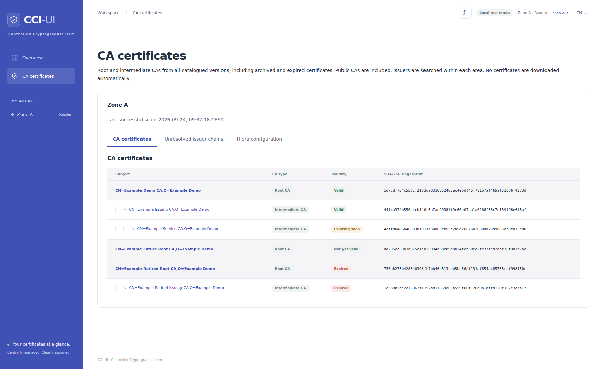

# CA inventory and Hiera export

Set `CCI_CA_INVENTORY_ENABLED=true` in both the web and indexer environments.
The default is `false`. `1` also enables the feature. Recreate both services
after changing it. The **CA certificates** navigation entry opens
`/ca_inventories`. Each area groups its output into tabs for CA certificates,
unresolved issuer chains and, last, Hiera configuration. The page uses the full
available width, with horizontal scrolling for wide tables and YAML. Tabs support
arrow keys, Home and End. Without JavaScript, all sections remain visible.



The screenshot shows generated demonstration certificates and invented names.
No production inventory, organizations, users or private keys are included.
The **CA certificates** tab (**CA-Zertifikate** in German) presents roots followed
by indented intermediate CAs. **Unresolved issuer chains** (**Unvollständige
Ausstellerketten**) lists missing issuers, cycles and chains beyond the search
limit. A complete chain does not appear there merely because one of its
certificates is expired or not yet valid. **Hiera configuration** provides the
flat YAML list and download for the area.

Disabling the feature stops scans and hides both the page
and its download routes, while preserving the last stored snapshot.

After each successful full index pass, CCI-UI reads public certificate material
from all configured areas and both filesystem and Consul sources. All non-deleted catalogued
versions participate, including inactive, archived and expired certificates.
Issuer discovery stays within each area, matching the certificate detail page
and existing access permissions. A CA needed in multiple areas must be present
in each area's inventory.

Candidates must have `basicConstraints: CA:TRUE`, permit certificate signing
when a key usage extension is present. Issuer names and signatures must match.
Chain completeness is independent of certificate validity dates and active version
selection. Expired and not-yet-valid certificates can complete a chain.
Validity badges use the same states as the overview and are shown in both the CA
and unresolved-chain tabs. The Hiera export only includes currently valid CAs
that can be referenced. Consul exports require the active version because
`lookup` always resolves that selection. Self-signed roots and intermediate CAs are included
without an additional approval workflow. Chains are bounded to twelve issuer
hops, and cycles and missing usable issuers are reported on the page. This is
issuer discovery, not full TLS path validation or a revocation check.

Results are deduplicated by SHA-256 fingerprint within each area. The page labels
roots and intermediates and links back to certificate details. The CA tab groups
intermediates under their roots, with indentation for each issuer level. These
relationships come from the indexer's verified signature matches, stored as
fingerprint references in the PostgreSQL snapshot. A new index pass populates
these relationships for existing snapshots.

Certificate detail pages use the same hierarchy rows for the resolved issuer
chain, ending with the selected certificate. The detail-page chain
omits fingerprints and truncates long subjects with an ellipsis. Hovering over a
subject reveals its full value. Validity stays visible without horizontal scrolling.
On narrow screens, the certificate-type column is hidden to leave room for
subject and validity. The highest available
issuer appears first. Missing roots keep the incomplete-chain notice, and
certificates without a catalog entry remain visible without a detail link.

Roots and siblings are sorted by subject and fingerprint. If a CA has multiple
verified parents, it appears once under the first reachable root and branch in
that order. Missing roots, disconnected chains and cycles remain visible in a
separate section, preserving any available parent-child relationships without
repeating certificates. Expired parents remain visible above their descendants.
Subjects and issuers stay on one line, with horizontal scrolling when necessary.
The Hiera export stays flat.

The Hiera output
is a YAML list of source-specific references. Consul entries use `lookup` with
the unqualified CertID. Filesystem entries preserve the DN escaping and `.tag`
suffix from the certificate detail page:

```yaml
---
- issuer: CN=Example Root CA, O=Example
  subject: CN=Example Root CA, O=Example
- lookup: example-issuing-ca
```

`lookup` identifies Consul material, while `issuer` and `subject` identify
filesystem material. Each download belongs to the area shown on the page, which
must be retained in the consuming Hiera context. Existing filesystem references
need no migration. In the certificate detail page, Consul references appear in
the `cci::certificates` block with `area`, `lookup` and `path`.

Identical references appear once in the YAML, even if multiple distinct
certificates share those references. The page retains their separate
fingerprints. A reference does not pin a version: a Consul lookup resolves the
selected active version, and filesystem resolution follows the existing Puppet
lookup. Scanning historical versions does not make their material independently
addressable by this format. Consumers must validate the material resolved by
their lookup before installing it in a trust store.

This feature does not create Java stores or install certificates in an operating
system. It produces references for the consuming Puppet code.

CAs that expire between scans are immediately excluded from YAML. Displayed
validity badges update at request time. The scan timestamp and chain diagnostics
still describe the last scan.
A source read failure retains the previous complete snapshot and marks it stale.
A successful later scan clears that warning. Private keys are never loaded.

## Public CAs and trust stores

Public CAs are included when present in the local inventory. No assumptions are
made about a target distribution, JDK vendor, version or customized trust store.
For a standalone Java trust store, the consumer must supply every required trust
anchor. When extending an existing store, compare certificate fingerprints with
the actual target store before adding duplicates. Name matching alone is not
sufficient to establish that the same certificate is already installed.

Adding an intermediate as a trusted certificate can make it a trust anchor in
its own right. Consumers can use the root/intermediate labels to decide which
certificates belong in their stores. CCI-UI does not automatically install either.

Missing issuers are reported without outbound AIA requests. A manually triggered
AIA download and preview is a possible follow-up feature.

Deleting a filesystem CA invalidates the area snapshot immediately. The next
scan rebuilds the hierarchy without deleted records and reports any resulting
issuer gaps. See [filesystem deletion](legacy-deletion.md).

## Reproducing the screenshot

The isolated screenshot stack seeds generated certificates and demo identities.
It has its own PostgreSQL and Consul services and does not mount real inventory
data. Start it with `docker compose -f script/screenshots/compose.yml up --build
-d --wait`. With Puppeteer and Chromium installed, run
`CAPTURE_CA_ONLY=1 node script/screenshots/capture.cjs`.
Use `PUPPETEER_MODULE` and `PUPPETEER_EXECUTABLE_PATH` for non-default installations.
The script checks hierarchy depth, validity badges, tab navigation and the
exclusion of expired and future CAs from Hiera before completing. Remove the
disposable services afterward with
`docker compose -f script/screenshots/compose.yml down --volumes`.
