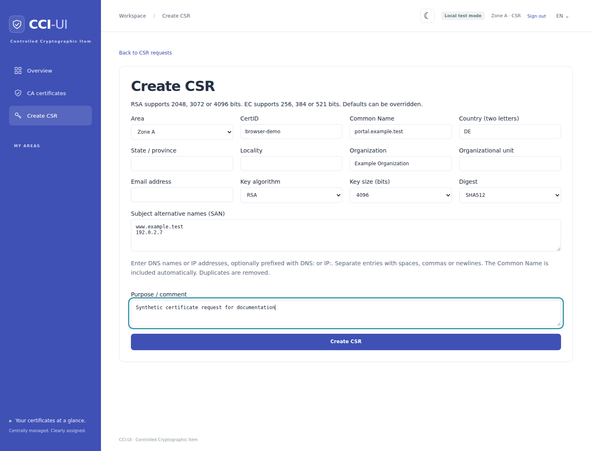

# CSR workflow and operations

The **CSR erstellen** menu uses the independent `<area>_csr` role. Writer,
Reader, Key Exporter and Auditor roles do not imply CSR access. Assign CSR roles
for each desired area through the existing OIDC role mapping. Local development
also provides `<area>_csr` and `all:csr` identities. CSR-only users land on this
page and have no general certificate export or management rights.

## Create and issue a certificate

1. Choose an area and CertID, enter the Common Name and SANs, and review the
   subject, algorithm, size and digest. The optional comment stays in PostgreSQL.
2. Create the CSR and download the PKCS#10 PEM request. No Consul write occurs yet.
3. If required by the issuer's portal, confirm access to the revoke password.
   The dedicated disclosure page supports manual selection and copying. It
   clears the field after one minute and when leaving the page. Every successful
   disclosure is audited before the response is released.
4. Submit the CSR and, separately, the revoke password to the issuer.
5. Upload or paste the issued certificate. PEM bundles can include issuer
   certificates. A single DER certificate is also accepted.
6. Review the publication status. Missing issuers and Consul failures retain the
   certificate in PostgreSQL. Add issuer certificates or correct the external
   failure, then retry publication. An existing CertID requires confirmation
   against its current Consul modify index before creating the next version.

The first overview lists requests with no issued certificate. The second lists
all certificates linked to application-generated requests, including previous
submissions. It does not include unrelated imports or legacy files. Replacements
require confirmation and retain earlier submissions. The same fingerprint cannot
be submitted twice for one request. Only the newest submission can be published.
An unresolved publication intent must be reconciled before replacing it.



The screenshot uses only synthetic data from `script/screenshots/compose.yml`.
After starting that disposable stack, run `test/browser/csr_test.cjs` with Node's
`--test` option and `CSR_SCREENSHOT=1` to regenerate it. Configure
`PUPPETEER_MODULE` and `PUPPETEER_EXECUTABLE_PATH` for your local browser setup.
The test also checks confirmed disclosure and clearing the secret on page exit.
Dispose of the screenshot stack with `docker compose -f
script/screenshots/compose.yml down --volumes` afterward.

## Validation

RSA supports 2048, 3072 and 4096 bits. EC supports P-256, P-384 and P-521.
SHA256, SHA384 and SHA512 are accepted. See [environment defaults](environment.md#csr-defaults).
The request is generated with Ruby OpenSSL in memory, includes an `extReq` SAN
extension, and is verified before storage. It has no `challengePassword`.

SANs accept DNS names and IPv4/IPv6 addresses, optionally prefixed by `DNS:` or
`IP:` and separated by whitespace, commas or semicolons. The Common Name is
included automatically. Names are canonicalized and duplicates removed. DNS
wildcards are allowed only as the complete first label. Internationalized names
must use their ASCII representation. URI and email SANs are unsupported. The
optional subject email address is separate from SANs. A request has at most 100
input SAN entries plus its automatically included Common Name.

Uploads are limited to 20 MiB and 20 PEM certificates, or a single DER
certificate. Private-key uploads are rejected. Exactly one certificate must
match the CSR public key, its canonical Common Name and the exact canonical SAN
set. The validity interval must have a positive length. Expired or not-yet-valid
certificates can be retained and published, with their dates visible.

Publication verifies the certificate's signature using an uploaded issuer or a
retained certificate from the same area. Issuers must have CA basic constraints
and, when key usage is present, certificate-signing permission. A self-signed
certificate must verify with its own public key. Missing issuers keep the entry
in `awaiting_issuer`. An available issuer with an invalid signature is rejected.
This verifies the direct cryptographic issuer, not public trust, a complete trust
path, revocation, or the issuer's current validity. Uploaded issuers are retained
for verification but are not automatically published as separate Consul entries.

## Persistence, failures and retries

`certificate_requests` stores the CSR, area, CertID, creator, public request fields
and two authenticated ciphertext envelopes. `csr_certificates` stores each issued
certificate, issuer material, public metadata, verification/publication status and
an optional durable Consul transaction intent. Migration
`20260924000300_create_certificate_requests` adds these tables with foreign keys,
a unique per-request fingerprint, and status constraints.

| State | Meaning and next action |
| --- | --- |
| Created, no certificate | CSR saved locally, ready for issuance |
| `awaiting_issuer` | Certificate saved, supply or index its issuer and retry |
| `pending` | Signature checked, publication still required |
| `publishing` | Exact Consul transaction saved before sending it, retry after interruption |
| `failed` | Certificate retained, fixed error code describes publication failure |
| `published` | The immutable certificate and encrypted key version were confirmed in Consul |

Creation and its audit event commit in one PostgreSQL transaction. A database
failure leaves no saved request. Invalid or mismatched uploads do not replace
existing records. PostgreSQL failures are errors, never successful publication
responses. Audit failure prevents revoke-password disclosure.

Consul publication uses the existing `CciWriter` CAS transaction and integer
versions under `<CONSUL_PREFIX>/<area>/certids/<certid>`,
`certs/<certid>/<version>` and `keys/<certid>/<version>`. The client marker is
`cci-ui-csr`, with the authenticated actor. Existing rollout/archive metadata is
preserved. The private key uses the existing area-key encryption and version AAD.
The revoke password is never sent to Consul.

PostgreSQL and Consul cannot share a transaction. Before sending, the application
saves the exact encrypted Consul operations and a separate audit intent. A retry
compares immutable certificate/key values with these operations. If the response
was lost after a successful commit, the existing version is acknowledged rather
than writing another version. A CAS conflict clears the obsolete intent and
requires a fresh preview/confirmation. Other transport errors preserve it.
A failed catalog refresh does not undo a confirmed Consul publication. The
indexer can refresh it later. The global catalog advisory lock serializes CSR
publication, replacement and other application mutations.

Publication errors are returned as a pending/failed state, never a success
notice. Audit records retain identifiers, actor, time and fixed outcomes/codes,
without secret values or raw transport errors. An interrupted mutation audit can
remain `pending` or `unknown` until a later separately audited retry resolves it.

Already authenticated sessions may use CSR pages while Consul is down, including
creation and revoke-password access. Login and other pages retain their existing
dependency policy. PostgreSQL remains required.

## HTTP interface

These routes use the existing authenticated session and Rails CSRF protection.
They are not a new token API. Send `Accept: application/json` or use `.json` for
JSON responses. All endpoints require the relevant area's CSR role. Users
without any CSR role receive 403, foreign records return 404, and invalid input
returns 422 for JSON. HTML mutations redirect with a localized notice or error.

| Method and path | Input and result |
| --- | --- |
| `GET /certificate_requests` | `{open: [...], issued: [...]}`, area-scoped public metadata |
| `GET /certificate_requests/new` | HTML form with environment defaults |
| `POST /certificate_requests` | `csr` object, returns 201 with public request metadata |
| `GET /certificate_requests/:id` | Public request and linked certificate metadata, `certid_index` and `consul_available` |
| `GET /certificate_requests/:id/download` | Audited PKCS#10 PEM download |
| `POST /certificate_requests/:id/reveal` | `confirm_reveal=1`, returns `{revoke_password: "..."}` only after auditing |
| `POST /certificate_requests/:id/upload` | `pem` text or multipart `file`, `confirm_replace=1` for replacement. Automatically attempts first publication after verification |
| `POST /certificate_requests/:id/issuers` | `certificate_id`, `pem` or `file`. Rechecks the issuer, then requires an explicit publication request |
| `POST /certificate_requests/:id/publish` | `certificate_id`, `certid_index` (0 for absent), `confirm_overwrite=1` for an existing CertID |

Creation fields: `area`, `certid`, `common_name`, `sans`, `country`, `state`,
`locality`, `organization`, `organizational_unit`, `email`, `key_algorithm`,
`key_size`, `digest`, `comment`. Defaults apply to omitted fields. Subject fields
may be blank except Common Name. CertIDs follow the existing 1–120 character
ASCII letters/digits/underscore/dot/hyphen rule.

Upload, issuer and publication responses return 200 only when published, otherwise
202 with `state` and `error_code`. Public JSON includes request/certificate IDs,
public subject/SAN/validity data and publication version/time. It never serializes
the models wholesale. Encryption envelopes, private keys, prepared transactions
and revoke passwords are excluded. The confirmed reveal endpoint is the sole
exception for the revoke password. Responses use private, no-store caching.

## Secret management and rotation

Both private keys and revoke passwords use the existing external area key from
`CCI_AREA_KEYS` or its established area fallback. Keys are Base64-encoded 32-byte
values. They are never stored in PostgreSQL. Each secret has a random AES-256-GCM
IV, authentication tag and versioned ciphertext envelope. Authenticated context
includes area, a stable random request identifier and secret purpose, preventing
swapping between requests, areas or private-key/password fields. Revoke passwords
use 32 random bytes encoded as URL-safe Base64. Neither secret is in the CSR,
normal HTML/JSON, audit metadata, or application-generated error messages.

Back up PostgreSQL and the external key configuration through separate protected
channels. Keep old keys for any backups they encrypt. Losing an area key loses
access to its stored secrets. Merely replacing the environment key is not a
rotation. No private-key export endpoint is added for CSR users.

Rotation is an offline operator procedure, not a UI action:

1. Stop all web, indexer and external writers for the area. Back up PostgreSQL,
   Consul and the old external configuration. Resolve any nonpublished prepared
   publication intents before proceeding.
2. Arrange the existing Consul key and import-draft rotation separately using
   their original authenticated contexts. The helper below rotates **only** CSR
   secrets. Do not restart with mixed old/new material.
3. Supply old/new keys through protected ephemeral environment configuration,
   not command-line arguments or shell history. In a maintenance Rails runner,
   execute the following code. All CSR changes and audit records are atomic. A
   bad key, decryption or audit failure rolls back the entire CSR step.

   ```ruby
   CsrSecretRotation.call(
     area: ENV.fetch("ROTATE_AREA"),
     old_key: ENV.fetch("ROTATE_OLD_KEY"),
     new_key: ENV.fetch("ROTATE_NEW_KEY"),
     actor: ENV.fetch("ROTATE_ACTOR")
   )
   ```

4. Update the external area-key configuration consistently for all readers and
   writers, remove the ephemeral rotation variables, and restart. Verify a CSR
   secret disclosure and an encrypted Consul key read under the new key. If any
   step fails, keep services stopped and restore the coordinated backup.

The helper refuses unresolved publication intents and discards completed intent
copies containing old encrypted Consul values. Original completed certificate
metadata and audit history remain. It does not rotate Consul, import drafts,
backups or external clients, and must not be used as an online key switch.
