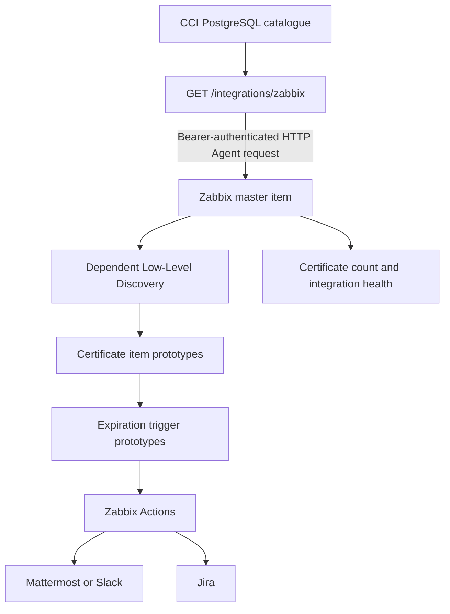
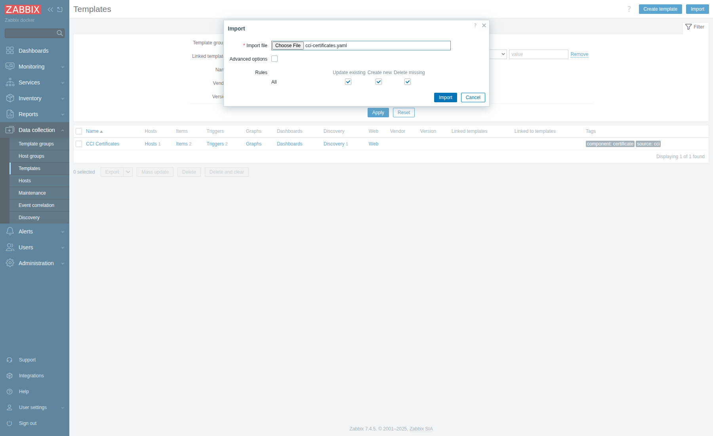
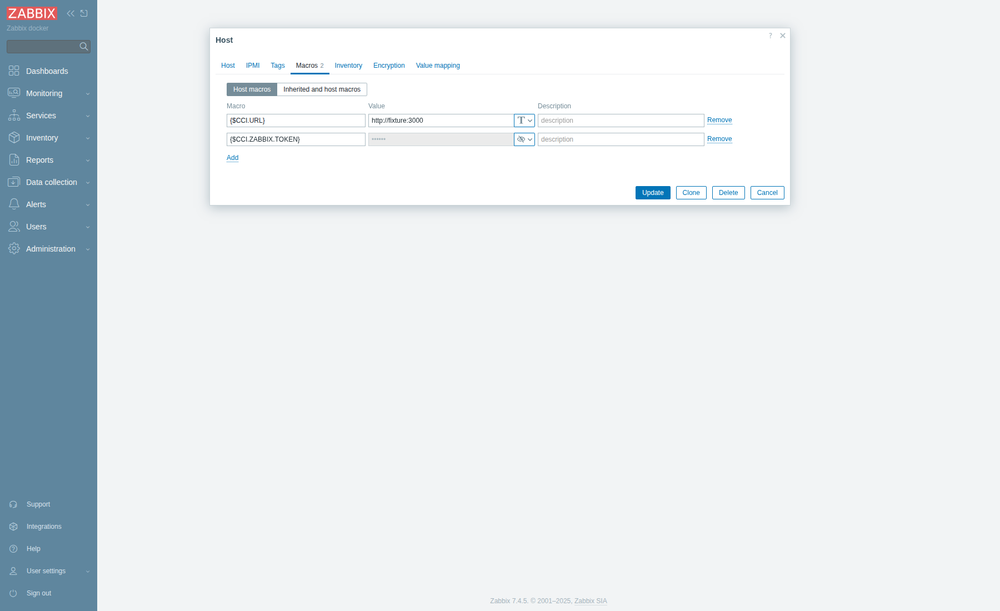
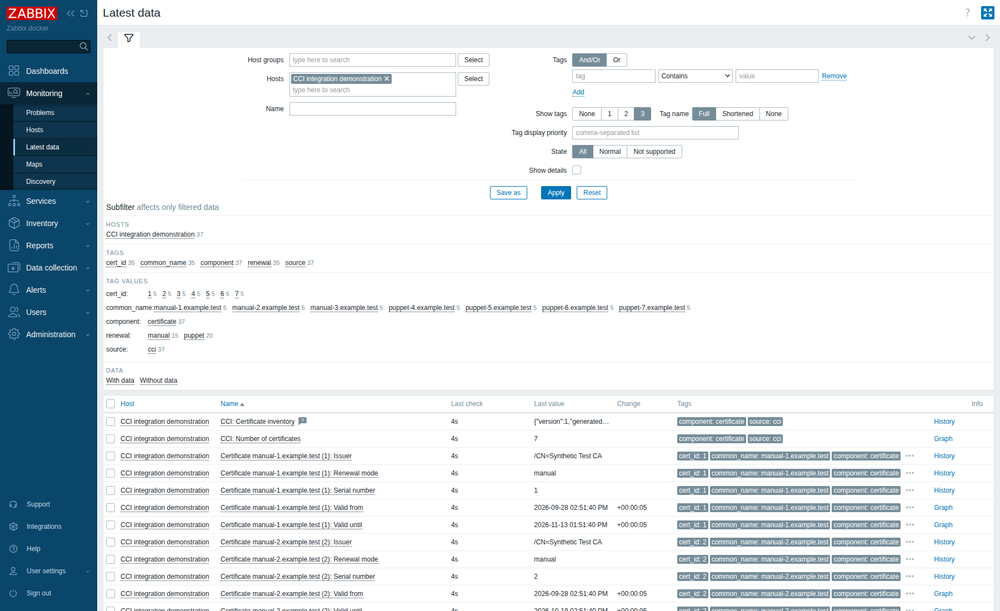
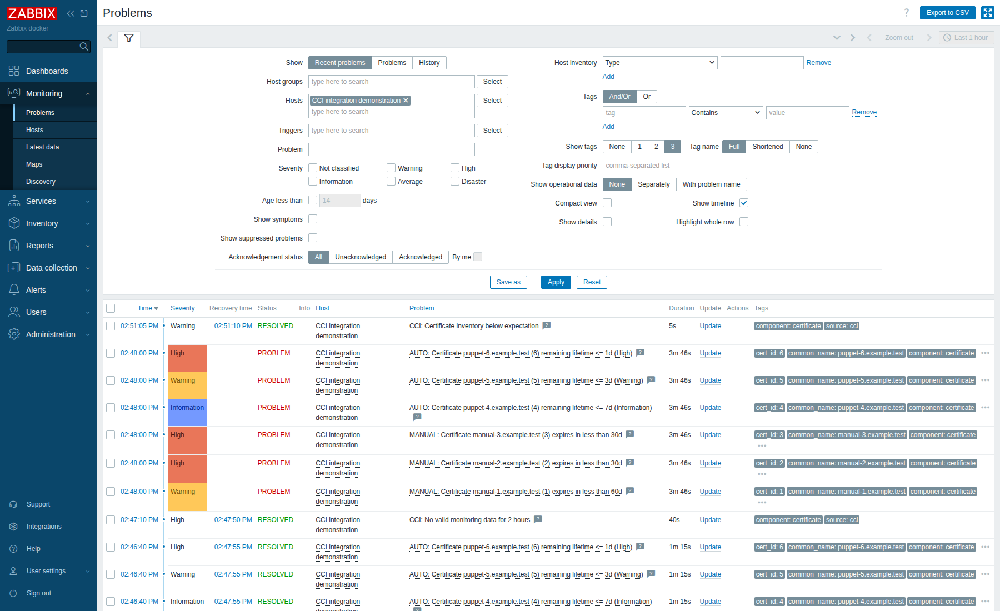

# Zabbix certificate monitoring

CCI-UI exposes public certificate metadata directly to Zabbix. There is no need
to copy certificate files or private keys to a Zabbix proxy. CCI supplies
inventory and lifecycle metadata. Zabbix owns discovery, thresholds and Actions.

The complete template is
[`integrations/zabbix/cci-certificates.yaml`](../../integrations/zabbix/cci-certificates.yaml).
It targets **Zabbix 7.4.5**, using the **7.4** YAML export format.



## Enable the endpoint

Generate a high-entropy token with `openssl rand -hex 32`. Store the result in
secret management and inject it into the **web** process:

```dotenv
CCI_ZABBIX_INTEGRATION_ENABLED=true
CCI_ZABBIX_INTEGRATION_TOKEN=<generated token>
CCI_ZABBIX_CERTIFICATE_SOURCES=consul
```

The default is `CCI_ZABBIX_INTEGRATION_ENABLED=false` and an empty token.
Only `true` (case insensitive) enables the integration. Missing or whitespace-only
tokens leave the endpoint unavailable and produce a configuration error at boot,
without printing the token. Restart/recreate web containers after configuration
changes. The supplied development and production Compose files forward these
variables. Their shared environment also passes them to other Rails processes,
which do not need the integration token. The inline full Compose example keeps
these settings on the web service.

Use HTTPS in production. Allow the Zabbix server or assigned proxy to reach CCI.
Preserve the `Authorization` header through reverse proxies, and exclude this
exact path from any upstream interactive SSO redirect. CCI still authenticates
every request with the dedicated token.

The token is sent **only** as `Authorization: Bearer <token>`. It must never be
placed in the URL, query string or screenshots. Configure proxy/access logging
to omit Authorization headers. CCI uses its existing parameter and structured
log redaction, including redaction of the configured token in exception messages.
Do not enable verbose HTTP logging of request headers in Zabbix or proxies.

The token permits reading public monitoring metadata across all configured areas.
It creates no user or application session and grants no UI, write, private-key,
CSR or revoke-password access. Authentication compares SHA-256 digests in constant
time. Keycloak sessions and credentials cannot substitute for the token.

| Request | Response |
| --- | --- |
| Integration disabled or enabled without a token | `404 Not Found`, empty body |
| Enabled, token missing, malformed or incorrect | `401 Unauthorized`, `WWW-Authenticate: Bearer` |
| Inventory unavailable | `503 Service Unavailable`, empty body, no interactive error details |
| Valid header token | `200 OK`, `application/json`, `Cache-Control: no-store` |

To rotate the token, replace it in CCI and the Zabbix host secret macro in the
same maintenance window, then recreate web containers. Only one token is active.

## Inventory and API contract

`GET /integrations/zabbix` returns this versioned representation:

```json
{
  "version": 1,
  "generated_at": 1790586000,
  "certificates": [
    {
      "id": 123,
      "common_name": "service.example.com",
      "issuer": "/CN=Example CA",
      "serial_number": "123456789",
      "valid_from": 1788220800,
      "valid_until": 1819756800,
      "renewal": "manual"
    }
  ]
}
```

All timestamps are Unix seconds in UTC. `serial_number` is a string, preserving
large serial numbers. `issuer` retains the catalogue's distinguished-name text.
`id` is the PostgreSQL certificate record ID, stable across normal reindexing.
Different source records or certificate versions, including duplicate CNs, have
different IDs. In `both` mode, only the chosen representative ID is exposed. Rebuilding the database can change IDs. The template uses IDs for
item keys and JSONPath lookup, never CNs. `valid_until` is authoritative, and
Zabbix does not parse PEM data. Breaking schema changes require another `version`.

The response contains current (`active=true`), retained, unarchived records in
configured areas, excluding rollout status `delete`. The default includes Consul
certificates only. CA certificates, expired certificates and `norollout`
certificates are included within the selected sources. Historical inactive Consul versions, archived records and confirmed
filesystem deletions are excluded. Pending CSRs are not certificates.

This is the existing searchable catalogue, not a fresh scan of Consul or the
filesystem. `generated_at` describes response generation, **not** the last source
refresh. An indexer outage can therefore leave a reachable endpoint with stale
inventory. Monitor the indexer and its existing health/logging separately.
The filesystem index deliberately retains records after a file disappears until
confirmed deletion, so removing a file alone does not remove its monitoring item.

### Sources and duplicate certificates

`CCI_ZABBIX_CERTIFICATE_SOURCES` selects existing catalogue records for monitoring:

| Value | Scope |
| --- | --- |
| `consul` | Consul only (default) |
| `filesystem` | Filesystem only |
| `both` | Both sources, deduplicated by the SHA-256 fingerprint of certificate DER |

Values are exact lowercase strings. Empty or unsupported values fail application
startup. A bad value encountered during a request produces HTTP 503, never an
empty or unexpectedly broad inventory. This setting does not change indexing,
filesystem locations, validity, ownership or lifecycle state.

In `both` mode, identical certificate bytes across paths, sources and areas
produce one monitoring entry. Consul metadata wins over filesystem metadata.
Within the same source, the lowest catalogue ID wins deterministically. Selection
first excludes inactive, archived, deleted and rollout-`delete` records. A retained
filesystem copy can therefore remain monitored after a Consul copy is archived.
If the selected representative disappears from the eligible set, the replacement
ID is discovered and the previous ID follows normal lost-resource handling.
Certificates with the same CN but different fingerprints remain distinct.
Single-source modes preserve individual catalogue records.

### Ownership and legacy references

`renewal` is either `manual` (user-managed) or `puppet` (automatically managed).
The existing `client` identifies the writer software. A Puppet client selects
`puppet`; other or missing client provenance selects the conservative manual
policy. `created_by` remains the responsible user or service-account identity and
does not select an automation policy. A user whose name contains `acme` or
`puppet` is still a user. PuppetDB host associations do not change ownership.

ACME is an issuance mechanism, not a separate owner or renewal category. Automated
writers must use `client: "puppet"`, including when they obtain certificates via
ACME. The database migration changes legacy ACME client references (case-insensitive
`acme` components separated by `.`, `_` or `-`) to `puppet`, preserving all records,
IDs, user identities and certificate material. New ACME client references are
rejected by the shared writer, model validation and a database constraint.

Existing immutable Consul versions are not rewritten by the database migration.
The indexer and Ruby/Puppet reader normalize their old ACME client metadata when
reading it, so reindexing cannot restore obsolete catalogue references. This is
the compatibility boundary needed for retained source data. Historical audit
records remain unchanged. Rollback removes the database constraint but keeps
normalized Puppet values, because original client names cannot be reconstructed
safely. Back up PostgreSQL before deployment if exact provenance restoration is
required. This mapping does not prove that renewal automation is working.

## Import and assign the template

1. Download the YAML file linked above, preserving its contents.
2. Open **Data collection → Templates → Import** in Zabbix 7.4.
3. Select `cci-certificates.yaml` as the **Import file**, keep creation of new
   templates and related entities enabled, then choose **Import** and confirm
   the import preview. When updating an existing template, enable **Delete missing**
   for triggers so the obsolete manual Disaster prototype is removed. Review
   the preview before applying. The result is **CCI Certificates** in
   **Templates/Applications**.
4. Open **Data collection → Hosts → Create host**. Choose a host name such as
   `CCI monitoring`, select a host group, and assign **CCI Certificates** in
   **Templates**. No agent interface is required.
5. Select the Zabbix server or proxy under **Monitored by** that can reach CCI.
6. In the host's **Macros** tab, configure the following values. Keep the token
   type **Secret text** when overriding the inherited macro.

| Macro | Value |
| --- | --- |
| `{$CCI.URL}` | CCI base URL, e.g. `https://cci.example.com`, without a trailing slash |
| `{$CCI.ZABBIX.TOKEN}` | Same token as `CCI_ZABBIX_INTEGRATION_TOKEN`, type **Secret text** (`SECRET_TEXT` in YAML) |
| `{$CCI.CERT.MIN.COUNT}` | Optional minimum expected inventory size, default `0` |

The template ships no token. Zabbix server/proxy TLS trust must include the CCI
issuer. TLS peer and hostname verification are enabled and redirects are disabled
to avoid forwarding authentication to another destination. Use the final HTTPS
URL directly.

The following captures show the actual Zabbix 7.4.5 import and host macro forms.
The local demonstration uses an isolated HTTP fixture. Production must use HTTPS.





## Items and discovery

The HTTP Agent item **CCI: Certificate inventory** (`cci.certificates.raw`) polls
once per hour, requires HTTP 200 and retains raw public JSON for one day. Its
JavaScript preprocessing rejects invalid JSON, unsupported versions, duplicate
IDs, malformed fields and responses older than two hours or more than five
minutes in the future. Both systems need synchronized clocks. Invalid responses
never become an empty discovery result.

**CCI: Certificate discovery** is dependent on that single master item and
extracts `$.certificates`. There is no HTTP request per certificate.

| LLD macro | JSONPath within each certificate |
| --- | --- |
| `{#CERTID}` | `$.id` |
| `{#CERTCN}` | `$.common_name` |
| `{#ISSUER}` | `$.issuer` |
| `{#RENEWAL}` | `$.renewal` |

| Item prototype key | Value |
| --- | --- |
| `cci.cert.valid_until[{#CERTID}]` | Unsigned expiration timestamp, displayed as Unix time |
| `cci.cert.valid_from[{#CERTID}]` | Unsigned validity-start timestamp |
| `cci.cert.issuer[{#CERTID}]` | Issuer text |
| `cci.cert.renewal[{#CERTID}]` | `manual` or `puppet` |
| `cci.cert.serial[{#CERTID}]` | Serial number string |

For example, expiration uses
`$.certificates[?(@.id == {#CERTID})].valid_until.first()` on the master response.
Items retain 30 days of history. Missing values are discarded while lost-resource
handling takes effect. Lost resources are disabled after **1 day**, deleted after
**30 days**. A new certificate version creates a new monitored ID. The old version
becomes lost. Check obsolete problems during the one-day grace period.

Under **Data collection → Hosts**, open the host's **Items**, select the master
item and choose **Execute now** to initialize collection. Check **Discovery** for
errors, then **Monitoring → Latest data**, filtering by the host. Expect five
items per discovered certificate, plus the raw inventory and count.



## Thresholds and problems

Five trigger prototypes are shipped. LLD overrides discover two manual prototypes
for `manual`, or three automatic prototypes for `puppet`. No expiration trigger
uses Disaster severity.

| Policy | Macro | Default | Effective range |
| --- | --- | --- | --- |
| Manual Warning | `{$CCI.CERT.MANUAL.WARN}` | `60d` | 30 days ≤ remaining lifetime < 60 days |
| Manual High | `{$CCI.CERT.MANUAL.HIGH}` | `30d` | Remaining lifetime < 30 days, including expired |
| Puppet Information | `{$CCI.CERT.AUTO.INFO}` | `7d` | 3 days < remaining lifetime ≤ 7 days |
| Puppet Warning | `{$CCI.CERT.AUTO.WARN}` | `3d` | 1 day < remaining lifetime ≤ 3 days |
| Puppet High | `{$CCI.CERT.AUTO.HIGH}` | `1d` | Remaining lifetime ≤ 1 day, including expired |

Zabbix time suffixes express seconds, so `7d`, `3d` and `1d` mean exactly 7, 3
and 1 days. Keep `AUTO.INFO > AUTO.WARN > AUTO.HIGH > 0` and
`MANUAL.WARN > MANUAL.HIGH > 0`. Thresholds remain configurable through macros.
Expressions use the expiration timestamp minus current server time, without
rounding to whole days. At the exact 7/3/1-day boundaries Puppet severity is
Information/Warning/High respectively. Above seven days there is no Puppet alert.
The ranges are mutually exclusive. Expired certificates remain High.

Manual Warning and High thresholds retain their previous values and strict
upper boundaries. The previous Disaster stage below 14 days is removed:
certificates remain High there, without opening another same-severity event.
The obsolete `MANUAL.CRIT` and `AUTO.CRIT` macros are removed. When upgrading,
review host-level overrides of `AUTO.WARN` and `AUTO.HIGH`, whose defaults now
mean 3 and 1 days, and remove obsolete CRIT overrides. Import the updated template
before deploying CCI, so legacy `acme` payloads fail validation until the new
endpoint is live, rather than silently selecting an incorrect policy. Existing
lost resources follow the configured disable/delete grace periods.

Expiration triggers do not open new problems without valid master data for two
hours. Their explicit recovery expressions also require fresh data, so existing
problems remain open during outages. With fresh data, severity transitions and
recovery resume.

Open **Monitoring → Problems**, filter by the monitoring host and
`component=certificate`. A manual certificate with 20 days remaining produces
High, while a Puppet certificate with 20 days remaining produces no expiration
problem. Review the **Tags** column to confirm the renewal routing.

Integration health is monitored separately:

- **CCI: No valid monitoring data for 2 hours** (High) covers endpoint/network
  outages, 401 responses, TLS errors, malformed JSON, unsupported schema versions
  and stale responses. The master item's error provides the specific cause.
- **CCI: Number of certificates** is a dependent count item.
- **CCI: Certificate inventory below expectation** (Warning) fires below the
  configured minimum, or when the count becomes zero after being positive within
  the preceding 30 days. A newly configured, legitimately empty catalogue is
  allowed by default. Set a minimum to detect persistent unexpected emptiness.



## Action routing

Certificate items and expiration problems carry these tags:

| Tag | Value |
| --- | --- |
| `component` | `certificate` |
| `source` | `cci` |
| `renewal` | `{#RENEWAL}` |
| `cert_id` | `{#CERTID}` |
| `common_name` | `{#CERTCN}` |

Configure **Alerts → Actions → Trigger actions** with conditions on these tags
and severity. Example policy, outside CCI application logic:

- `renewal=manual` and Warning → Jira workflow.
- `renewal=puppet` and High → Mattermost or Slack.

CCI does not create tickets or send chat messages. Configure Zabbix media types,
recipients and recovery operations separately. Because escalation changes the
active problem, configure ticket correlation using `cert_id` where needed.

## Troubleshooting

| Symptom | Check |
| --- | --- |
| HTTP 404 | Enabled flag, nonempty token and deployed application version |
| HTTP 401 | Host secret macro matches the deployment token, Authorization header reaches CCI |
| Redirect or HTML login page | Upstream SSO exemption for the integration path, final base URL |
| TLS/network error | Server/proxy connectivity, trusted CA, hostname, firewall |
| Unsupported master item | Item error, JSON schema/version, timestamp skew, duplicate IDs |
| No certificate items | Master item has data, host/template linkage, discovery errors, inventory scope |
| Unexpected policy | Writer `client`, migration status and discovery refresh |
| Replaced certificate still visible | Old ID is lost, one-day disable and 30-day delete grace periods |
| Fresh response but outdated certificates | Indexer process, source refresh errors and retained filesystem records |

Do not paste tokens or request headers into support tickets. The integration is
read-only and does not repair an unavailable source or trigger certificate renewal.

## Repeatable validation and screenshots

The Rails suite includes endpoint authentication, exact public fields, inventory
selection, lifecycle mapping, token filtering, failure responses and template
structure tests. Run it using the current image and isolated services as described
in the [contribution guide](../../CONTRIBUTING.md#development-and-validation).

For a real Zabbix import and discovery test, use the disposable stack below. It
contains only synthetic public metadata and demonstration credentials. Python 3
uses only its standard library. Port `18074` must be free.

```console
docker build -t cci-ui:ci .
docker compose -f script/zabbix/compose.yml up -d
# Wait for http://127.0.0.1:18074 to show the login page.
python3 script/zabbix/verify.py
# Optional: use an installed Puppeteer version compatible with your Node runtime.
PUPPETEER_MODULE=/absolute/path/to/puppeteer node script/zabbix/capture.cjs
docker compose -f script/zabbix/compose.yml down --volumes
```

`PUPPETEER_EXECUTABLE_PATH` can select an installed Chromium executable. The
capture script uses the existing 1800 × 1100 screenshot convention, never modifies
the page DOM or styles, and checks that the synthetic token is not visible.
Images are written to `docs/screenshots/zabbix-*.png`. No CCI UI elements are
changed by this integration.

The validation script imports the shipped YAML into **7.4.5**, checks HTTP Agent
and dependent relationships, macros, LLD paths, overrides, 35 generated items,
both policies and all five trigger prototypes and tags. It exercises invalid JSON, schema mismatch,
stale timestamps, 503, 401, recovery and sudden empty inventory. Only the disposable
host's polling interval is shortened to five seconds. During the outage regression,
the disposable template's no-data windows are shortened to 30 seconds. The script
checks that all six open expiration events survive both an outage and return of
unchanged data, and close only when healthy certificate values arrive. It restores
the original expressions afterwards. The shipped template retains `1h` polling
and `2h` no-data windows.
It leaves a demonstration host for screenshots. Always remove the disposable
stack afterwards. The script replaces only its named demonstration host.

The 1-day disable and 30-day delete settings are checked after import, but the
validation does not wait for those real-time intervals to elapse. The no-data and
recovery behavior is exercised with accelerated windows rather than waiting two
hours. Production TLS trust and downstream Actions
must be validated in the target deployment.

Screenshots were captured from the running Zabbix 7.4.5 web interface with
synthetic data. Zabbix UI copyright © 2001–2025 Zabbix SIA, licensed under
GNU AGPL version 3, as stated in the installed UI source headers. Zabbix names
and logos remain the property of their respective owners. No upstream template
code or third-party font assets are bundled with this integration.

## Compatibility references

The template uses the official Zabbix 7.4 contracts for
[template import/export](https://www.zabbix.com/documentation/7.4/en/manual/xml_export_import/templates),
[dependent items](https://www.zabbix.com/documentation/7.4/en/manual/config/items/itemtypes/dependent_items),
[JSONPath](https://www.zabbix.com/documentation/7.4/en/manual/config/items/preprocessing/jsonpath_functionality),
[Low-Level Discovery](https://www.zabbix.com/documentation/7.4/en/manual/discovery/low_level_discovery),
[HTTP Agent](https://www.zabbix.com/documentation/7.4/en/manual/config/items/itemtypes/http),
and [trigger expressions](https://www.zabbix.com/documentation/7.4/en/manual/config/triggers/expression).
