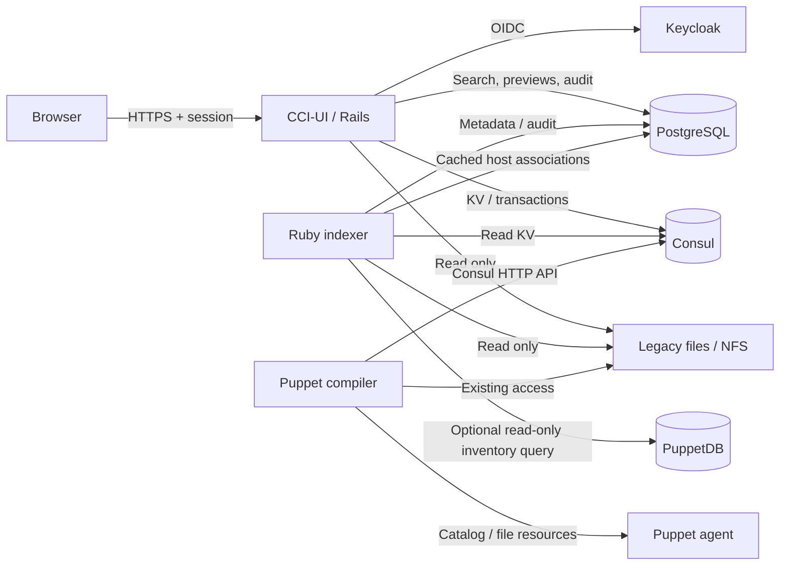

# CCI-UI: technical architecture

As of 16 September 2026. This document describes configurable areas, import
confirmation, Consul-only status and archiving, retained filesystem inventory,
audit logging and optional PuppetDB host associations.
Consul is the authoritative store for imported certificates.

## Components and data flow

Rails serves user requests, enforces permissions, processes X.509 certificates
and container formats, and writes Consul transactions. The indexer runs as a
separate Ruby process using the same container image. PostgreSQL provides the
shared search index and relational management database. Consul is the source of
truth for new certificates and keys. The file system remains the source of truth
for legacy material; no material migration takes place. Only Consul certificates
have mutable Puppet status and archive metadata. Filesystem entries remain
read-only in the PostgreSQL catalog.

Puppet uses the Consul HTTP API directly. Rails, Keycloak and PostgreSQL are not
in the runtime path of a Puppet compile. Consul must remain available for these
requests. Existing NFS access is unchanged.

## PostgreSQL

| Table | Contents and responsibility |
| --- | --- |
| `certificates` | Area, source, source reference, originating `client`, `created_by` actor, lookup, SHA-256 identity, optional SHA-1 digest, subject, issuer, SANs, tags, validity, key availability, active version, `rollout_status`, `archived`, cached PuppetDB hosts/query timestamps and search text |
| `audit_events` | Actor, action, area, event time in `occurred_at`, references and persistent certificate metadata/export options in `details`; `store_event_id` prevents duplicate ingestion of Consul events |
| `import_drafts` | Session owner, random preview token, expiry after 15 minutes, parsed import data with private keys already encrypted, destination lookup indexes and previous version IDs |

Certificate metadata contains neither private keys nor import passwords. Import
previews contain public certificates and separately encrypted keys. A preview
is consumed once under a database lock; the indexer removes expired previews.
Each preview is bound to its login session. Permissions for all selected areas
are checked again before saving. Before preview and commit, a fresh disk scan
rejects any upload containing certificate DER already in any configured legacy inventory,
independent of lookup and destination area. The whole batch is rejected before
writes; stale search metadata is not used to decide duplication. An incomplete
or unavailable inventory blocks the upload. Existing destination lookups require explicit
overwrite confirmation. A changed lookup index, including a new lookup created
after preview, rejects that entry and requires a fresh preview.

`pg_trgm` indexes search text. Multiple search terms are combined with AND.
Subject, issuer, CN, SANs, tags and Puppet lookup are searchable; fingerprints
and hexadecimal serial numbers also support normalized exact matching. SQL
handles filtering and sorting, with 30 results per page. Weighted relevance
ranking and typo correction are not currently implemented.

## Consul data contract v1

Default prefix: `cci/v1`. `<area>` is a stable ID from `CCI_AREAS`.

| KV path below the prefix | Value |
| --- | --- |
| `areas/<area>/lookups/<lookup>` | JSON containing `entry_id`, `active_version`, `status` and optional `archived`, `archived_at`, `archived_by` |
| `areas/<area>/versions/<version_id>` | JSON containing `schema`, `entry_id`, `lookup`, `pem`, `chain`, `tags`, `fingerprint`, `public_key_fingerprint`, `has_key`, `created_at`, `client`, `created_by` |
| `areas/<area>/private-keys/<version_id>` | JSON containing encryption version, IV, authentication tag and ciphertext |
| `areas/<area>/filesystem-statuses/<fingerprint>` | Historical data only; ignored and retained without modification |
| `events/<uuid>` | JSON containing `action`, `area`, `id`, `actor`, `at`, `details` (certificate metadata and change context) |

`entry_id` is a UUID. The version ID is SHA-256 of
`entry_id:certificate_fingerprint`. Certificate fingerprints refer to DER;
public-key fingerprints refer to SubjectPublicKeyInfo DER. In the v1 contract,
`chain` and `tags` are JSON-encoded strings inside the outer JSON object.
The Consul HTTP API additionally Base64-encodes KV values for transport.

Every new writer identifies itself using `client` and records the initiating
user/service in `created_by`. CCI-UI uploads use `cci-ui`; historical versions
without provenance remain readable and display an unknown client. This is an
additive v1 extension. See the [complete schema and standalone Ruby example](consul-schema.md).

An explicit lookup is a stable name such as `portal.production`. Without a
custom name, the certificate fingerprint becomes the lookup. Renewing a stable
lookup creates and activates an additional version. Stored versions are never
overwritten or deleted by the application. Inactive versions of unarchived
lookups can be activated. Writers can archive an entire lookup after confirmation. The independent Puppet status is `active`, `norollout`, or
`delete`; setting `delete` retains material and the lookup. The status is shown
in the “Puppet-Status” column and has a separate filter from “Gültigkeit”. Writers
can change it only for Consul certificates. Filesystem entries have no mutable
state, and Puppet status filters exclude them. Status updates use CAS
and write audit metadata atomically. Renewals and version activation preserve
lookup status; missing historical status values default to `active`.

Status processing in Puppet is deferred. The current manifests continue their
existing file management; the Ruby metadata reader exposes the new value.
See [the complete contract](consul-schema.md#lookup-and-puppet-status) for the
planned rollout semantics; filesystem identity and retention are described in
the [legacy certificate section](consul-schema.md#legacy-certificate-status).

The version, active reference, optional key and audit event are written in one
Consul transaction. CAS on the lookup and `Index=0` when creating a version
prevent concurrent overwrites. Activation and archiving also check modification
indexes. Consul limits values to 512 KiB and transactions to 64 operations; the
application checks these limits. See [Consul KV](https://developer.hashicorp.com/consul/api-docs/kv)
and [Consul transactions](https://developer.hashicorp.com/consul/api-docs/txn).

A bulk import, including an import into multiple areas, consists of individual
atomic certificate writes. There is no transaction covering the entire batch.
Partial success is reported with a count and specific errors. Uploading the
same material into multiple areas creates independently authorized and encrypted
entries.

## Area configuration

`AreaConfiguration` parses `CCI_AREAS` and `CCI_LEGACY_PATHS` JSON objects from
the environment at process startup. There is no application configuration file
or filesystem lookup. `CCI_AREAS` is required and maps stable IDs to display
names. `CCI_LEGACY_PATHS` defaults to `{}` and maps any subset of those IDs to
absolute local directories, read separately by web and indexer. Invalid JSON,
unknown area references and relative paths reject startup. The configuration is
cached per process, so environment changes require recreating both services.

`CCI_AREA_KEYS` supplies encryption keys as a JSON object. Per-area `<ID>_KEY`
variables remain a fallback; explicit map entries take precedence. Shared
`AreaSecrets` parsing is used by Rails, the standalone writer and Puppet. The
Compose templates forward the maps, so adding an area needs no configuration
mount or service-definition change. See [environment configuration](environment.md).

Roles are generated from each ID and the suffixes `reader`, `writer`,
`key_exporter` and `auditor`. UI labels and local test identities use the
configured display names. Unknown roles grant no access. Existing IDs must not
be renamed or reused: they form part of Consul paths, audit records, roles and
the authenticated encryption context. Display names can be changed independently.
Removed areas become inaccessible; their stored certificates and audit records
are retained.

## Encryption and permissions

Private keys are encrypted with AES-256-GCM. Each area requires its own
Base64-encoded, 32-byte secret in `CCI_AREA_KEYS` or the fallback
`<UPPERCASE_AREA_ID>_KEY` variable. The authenticated
additional data is `cci:v1:<area>:<version_id>`, preventing successful decryption
when areas or versions are swapped. Key material and source passwords are
filtered from request logs. Exports use `Cache-Control: no-store`; private PEM
exports are password-protected.

| Role within an area | Search / details | Import / versions / status / archive | Certificate export | Private-key export |
| --- | --- | --- | --- | --- |
| Reader | Yes | No | No | No |
| Writer | Yes | Yes | Yes | No |
| Writer + Key Exporter | Yes | Yes | Yes | Yes |
| Key Exporter alone | No | No | No | No |

Version activation, status editing and archiving apply only to Consul
certificates. Auditor is an independent role for reading audit logs, without
certificate access or export permissions.

Roles follow the patterns `<area_id>_writer` and `<area_id>_key_exporter`.
Additional roles grant permissions only within their area. Bulk exports check
every selected record, including selections spanning multiple areas. Any
unauthorized record causes the entire export to fail.

Keycloak is connected through OIDC Authorization Code with PKCE. The library
validates the ID token. Roles are read from `groups`, `realm_access.roles` and
client roles, and can be translated through `OIDC_ROLE_MAP`. These claims must
be available to the Keycloak client. Sessions last one hour; role changes take
effect when a new session is established. Immediate role revocation and
Keycloak backchannel logout are not yet implemented. Local mode uses test
identities generated from configuration and is prohibited in production.

Consul machine credentials are separate ACL tokens, independent of UI Reader
roles. Compilers need read access to their area's lookups and versions, plus
its private-key path and decryption secret when distributing keys. Tokens are
sent in headers, not URLs.

## Audit logs

`<area_id>_auditor` grants read access only to that area's audit logs at
`/auditlogs`. Multiple Auditor roles allow a combined view of the corresponding
areas. These roles are independent of Reader, Writer and Key Exporter;
those roles do not automatically grant audit access. Authorization occurs before
querying and restricts search, filters, counts and pagination to permitted areas.

All successful certificate writes through the application are recorded:
import/new version, activation, archiving, and status changes for Consul
certificates (including old and new status). Historical filesystem status events
remain readable; new filesystem events only record exports.
The audit event is written atomically with the change in Consul and ingested idempotently
into PostgreSQL. `occurred_at` comes from the original event; `created_at` records
ingestion time. CN, subject, issuer, serial number, SHA-256 fingerprint, source,
version ID and lookup remain available after source material disappears. Import and activation
also record the previously active version. Tags and key availability are retained.

All successful CCI-UI exports (legacy files and Consul; PEM, DER, PFX, JKS, ZIP
and chains) are recorded in PostgreSQL after generation and before HTTP delivery.
Records contain the user ID (Keycloak's stable `sub`), time, area, format,
filename, key/chain options, and metadata for all selected certificates and
chain certificates actually included. Cross-area exports create one event per
area in a single database transaction. If audit persistence fails, no download
is delivered. An event confirms availability for delivery, not complete receipt
or storage on the user's device.

The UI shows Europe/Berlin time, including seconds and time zone. It provides
text search, area/action filters, inclusive date ranges and 30 events per page.
It offers no way to modify or delete events. Passwords, private keys and PEM
contents are excluded. Older entries without metadata remain visible as
historical references; timestamps of previously ingested legacy entries reflect
their original recording time. There is no automatic retention limit. Back up
PostgreSQL, particularly export events, which are not stored in Consul.

The scope covers certificate changes and exports through CCI-UI. Temporary
import previews, index updates, failed attempts, and direct Puppet/NFS/Consul
access outside the application are not included. The log is not a tamper-proof
archive against database or Consul administrators.

## Indexing and consistency

A PostgreSQL advisory lock serializes scheduled indexing and refreshes after
upload, activation or status changes. The indexer reads legacy files and public
Consul versions and ingests audit events idempotently. It never deletes
certificate catalog records or status metadata when a source entry disappears.
Empty or unavailable mounts therefore cannot erase the catalog. ACL-filtered
Consul responses are treated as errors. All public versions are scanned
periodically; Consul blocking queries are not yet implemented.

If a Consul write succeeds but indexing fails, source data remains intact and
the next successful scan repairs the index. There is no distributed transaction
between Consul and PostgreSQL. The index is never used as the material source
for certificate or key exports. Source reference, area and fingerprint are
checked again when loading.

Legacy files are accessed through the read-only root configured for their area. Symlinks outside
that directory are rejected. Multiple certificates in one PEM file receive
separate search records using the file path and block index. A certificate may
therefore appear more than once. `CCI_LEGACY_PATHS` determines directory-to-area
assignment. The catalog key includes area, source, relative file/block ID and
fingerprint, so replacing a file preserves the previous entry and
matching filenames in different roots are distinct records. Material reads,
private-key exports and Hiera tag reads explicitly select the record's area.
Removing a mapping blocks material reads and retains catalog rows and Consul
status metadata. Missing or unreadable roots and malformed certificates report
indexing failures, while other areas and Consul indexing continue. Filesystem
indexing does not access Consul status paths. Historical filesystem status keys
are ignored and retained, while migration `20260916000400` resets their obsolete
local projections and enforces unarchived read-only filesystem rows.

Archiving persists `archived: true` together with Puppet `status: delete` and an
`archive` event in one Consul CAS transaction. Confirmation includes the scope:
all versions of a Consul lookup in an area. Only Consul entries can be archived.
The PostgreSQL archive flag is projected from Consul and survives reindexing.
The overview and counts exclude archived entries; text searches and the
“Archivierte einschließen” option include them, even old versions. Material
availability does not prevent viewing retained filesystem details. There is no UI action to reverse archiving. Renewals preserve a
lookup's archive state. See the [schema lifecycle rules](consul-schema.md#archiving).

## Optional PuppetDB host enrichment

When enabled, each scheduled indexing pass runs a PuppetDB inventory query after
the filesystem and Consul stages, including when either earlier stage reported
an expected source error. A PuppetDB failure does not undo certificate indexing.
Interactive Consul refreshes after UI mutations do not contact PuppetDB.

The client posts PQL as JSON to `/pdb/query/v4`, verifies TLS and optionally uses
a client certificate and/or token. It requests the full result once, checks
`X-Records` when supplied and bounds the response size. Only the configured
certificate fact is interpreted. Malformed rows, fingerprints or missing facts
reject the entire synchronization before associations change.

`certificates.puppetdb_hosts` contains sorted, unique certnames;
`puppetdb_checked_at` records the last successful complete observation and
`puppetdb_error_at` records a failed attempt. Updates are atomic across catalog
records. The mapping uses the configured SHA-256 or SHA-1 fingerprints across
areas, sources and versions, including archives. SHA-256 remains the catalog
identity; the indexer additionally computes `sha1_fingerprint` from DER. Records
without that additional digest retain their previous observations in SHA-1 mode
until their source can be reindexed. It changes no certificate metadata, archive flags,
rollout status, Consul data or audit events. See [PuppetDB integration](puppetdb.md).

## Operations and limitations

Certificate metadata can be rebuilt after PostgreSQL loss only while its source
material still exists. Retained catalog entries for absent sources, export audit
history and pending import previews require a PostgreSQL backup. Consul backups must include
legacy status records as well as lookups, versions, encrypted keys and events.
Consul snapshots and area secrets are both needed to recover new private keys. Do not bake secrets into images.
Rotation with multiple simultaneously active encryption keys is not implemented;
existing secrets must not simply be replaced.

Chains are assembled using issuer/subject matching and signature verification.
This does not validate trust stores, OCSP or CRLs. JKS reads versions 1 and 2
and writes version 2; store and key passwords must match. PKCS#12 supports
multiple keys and certificates, AES/PBES2 and 3DES. RC2 and unknown bag types
produce an error rather than being silently ignored.

Tests use synthetic data. The production Keycloak realm, Consul ACLs and existing
Puppet NFS lookup have not been tested against your infrastructure because its
configuration has not been supplied.
